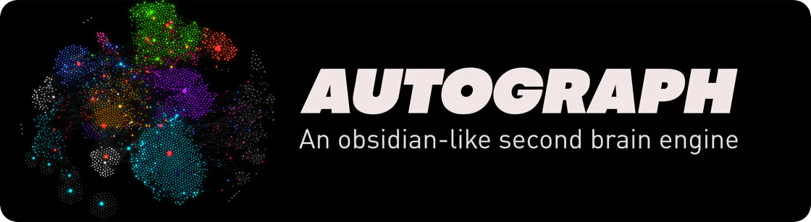

<div align="center">

# 🧠 autograph



**Типизированный слой памяти для always-on агентов. Одна схема, один граф, любой Obsidian-vault.**

[](https://github.com/smixs/autograph/releases)
[](https://www.python.org)
[](https://github.com/smixs/autograph)
[](./LICENSE)

[🇬🇧 English](./README.md) · **🇷🇺 Русский**

</div>

---

Агент каждый день пишет тебе заметки в Obsidian — голосовые расшифровки, встречи, идеи, контакты. Через месяц там 800 файлов, битые wiki-ссылки, дубликаты, и никто не помнит, что значит поле `status: ongoing` против `status: active`. **`autograph` — это слой, который всё это держит в порядке автоматически.**

Ты описываешь один раз в `schema.json`: какие бывают типы карточек (заметка, контакт, проект, CRM-сделка), в какой папке что лежит, как быстро стареет знание, какие статусы допустимы. Дальше движок сам: раскладывает новые файлы, чинит ссылки, забывает то, что не трогал полгода, сливает дубликаты, считает health-score. Один `schema.json` понимают и Claude Code, и OpenClaw, и Hermes, и Codex — любой агент, который пишет в твой vault.

<details>
<summary><b>📋 Оглавление</b></summary>

- [⚡ Установка](#-установка)
- [🚀 Быстрый старт](#-быстрый-старт)
- [💡 Сценарии использования](#-сценарии-использования)
- [⏰ Расписание (cron)](#-расписание-cron)
- [🧬 Как работает decay](#-как-работает-decay)
- [📦 Что внутри](#-что-внутри)
- [🔗 Откуда проект](#-откуда-проект)

</details>

## ⚡ Установка

<details>
<summary><b>Claude Code</b> — marketplace или прямая установка</summary>

```
/plugin marketplace add smixs/autograph
/plugin install autograph@autograph
```

Без регистрации marketplace:

```
/plugin install github:smixs/autograph
```

Обновить / удалить:

```
/plugin marketplace update autograph
/plugin uninstall autograph
```

</details>

<details>
<summary><b>OpenClaw</b> — через bundle-детект <code>.claude-plugin/plugin.json</code></summary>

```bash
git clone https://github.com/smixs/autograph.git ~/dev/autograph
openclaw plugins install ~/dev/autograph
openclaw gateway restart
```

Skill встанет в `~/.openclaw/skills/autograph/`, команда `/autograph:research` доступна глобально. Для одного workspace — клонируй в `<workspace>/.agents/skills/autograph/`.

</details>

<details>
<summary><b>Hermes</b> (NousResearch) — github source</summary>

```bash
hermes skills install github:smixs/autograph/skills/autograph
```

Skill окажется в `~/.hermes/skills/autograph/`. Hermes не поддерживает slash-команды в формате Claude Code — `commands/research.md` игнорируется, но вся логика живёт в skill, вызови его по имени в чате.

Переезжаешь с OpenClaw на Hermes? `hermes claw migrate` перенесёт autograph в `~/.hermes/skills/openclaw-imports/`.

</details>

<details>
<summary><b>Codex</b> — через symlink</summary>

```bash
git clone https://github.com/smixs/autograph.git ~/dev/autograph
ln -s ~/dev/autograph/.claude-plugin ~/dev/autograph/.codex-plugin
```

Добавь `~/dev/autograph` в agents-конфиг Codex.

</details>

## 🚀 Быстрый старт

```bash
# 1. На любом vault — пустом, хаотичном, или уже наполненном
/autograph:research /путь/к/vault

# 2. Ежедневный health check
uv run skills/autograph/scripts/graph.py health /путь/к/vault

# 3. Прогон decay: пересчёт relevance и tier для всех карточек
uv run skills/autograph/scripts/engine.py decay /путь/к/vault

# 4. Перегенерация Map-of-Content индексов
uv run skills/autograph/scripts/moc.py generate /путь/к/vault
```

Полный bootstrap (10 фаз: discover → generate → swarm → enforce → cleanup → tag → dedup → link → MOC → verify) — в `skills/autograph/references/bootstrap-workflow.md`.

## 💡 Сценарии использования

| Сценарий | Команды | Зачем |
|---|---|---|
| **Аудит чужого vault** | `discover.py` → `graph.py health` → `graph.py fix --apply` | Понять состояние перед любыми изменениями |
| **Bootstrap пустого или хаотичного** | `/autograph:research <vault>` | Интерактивный Q&A + рой explorer-агентов → draft схемы → твоё approve |
| **Создание карточки с линками** | Workflow 3 в SKILL.md: тип → путь → frontmatter → `## Related` (hub + 2 siblings) → `engine.py touch` | Orphan-карточки — мёртвое знание. Skill отказывается "закрывать" задачу пока линки не проставлены |
| **Импорт из CRM / внешнего источника** | `engine.py init` → `enforce.py --apply` → `enrich.py tags --apply` → `enrich.py swarm-links --apply` | Экспорт из HubSpot / Notion / OneNote / Apple Notes становится неотличим от ручных карточек |
| **Spaced repetition забытого** | `engine.py creative 5 <vault>` + cron | 5 самых старых карточек поднимаются в `warm` tier для повторного просмотра |

## ⏰ Расписание (cron)

Ночью — decay + health. По воскресеньям — dedup + MOC.

<details>
<summary><b>OpenClaw cron</b></summary>

```bash
openclaw cron add --name "autograph-daily" \
  --cron "0 3 * * *" --tz "Europe/Amsterdam" \
  --session isolated --tools exec,read \
  --message "uv run ~/.openclaw/skills/autograph/scripts/engine.py decay /path/to/vault && uv run ~/.openclaw/skills/autograph/scripts/graph.py health /path/to/vault"

openclaw cron add --name "autograph-weekly" \
  --cron "0 4 * * 0" --tz "Europe/Amsterdam" \
  --session isolated --tools exec,read \
  --message "uv run ~/.openclaw/skills/autograph/scripts/dedup.py /path/to/vault --apply && uv run ~/.openclaw/skills/autograph/scripts/moc.py generate /path/to/vault"
```

</details>

<details>
<summary><b>Hermes cron</b></summary>

```bash
hermes cron create "0 3 * * *" "autograph decay + health on /path/to/vault" --skill autograph
hermes cron create "0 4 * * 0" "autograph dedup + MOC on /path/to/vault" --skill autograph
```

Вывод джобов — в `~/.hermes/cron/output/{job_id}/{ts}.md`.

</details>

<details>
<summary><b>Системный cron</b></summary>

```cron
0 3 * * *  cd /path/to/vault && uv run ~/dev/autograph/skills/autograph/scripts/engine.py decay . >/tmp/autograph-decay.log 2>&1
5 3 * * *  cd /path/to/vault && uv run ~/dev/autograph/skills/autograph/scripts/graph.py health . >/tmp/autograph-health.log 2>&1
0 4 * * 0  cd /path/to/vault && uv run ~/dev/autograph/skills/autograph/scripts/moc.py generate . >/tmp/autograph-moc.log 2>&1
```

</details>

**Целевые метрики:** health ≥ 90, broken_links = 0, description coverage ≥ 80%, stale (>90d) < 20%.

## 🧬 Как работает decay

Память моделируется по Эббингаузу — три механизма, всё настраивается в `schema.decay`:

<details>
<summary><b>1. Access count (spacing effect)</b></summary>

Каждый `touch` инкрементит `access_count`. Чем чаще обращение — тем медленнее забывание:

```
strength = 1 + ln(access_count)
effective_rate = base_rate / strength
relevance = max(floor, 1.0 − effective_rate × days_since_access)
```

Карточка с 5 touches затухает в ~2.6× медленнее, чем с одним.

</details>

<details>
<summary><b>2. Domain-specific rates</b></summary>

| Тип | Rate | Период полураспада | Почему |
|---|---|---|---|
| `contact` | 0.005 | ~100 дней | Люди не устаревают быстро |
| `crm` | 0.008 | ~62 дня | У сделок средний цикл |
| `learning` | 0.010 | ~50 дней | Знание блекнет умеренно |
| `project` | 0.012 | ~42 дня | Проекты имеют дедлайны |
| `daily` | 0.020 | ~25 дней | Дневник быстро теряет актуальность |
| default | 0.015 | ~33 дня | Fallback для прочего |

</details>

<details>
<summary><b>3. Graduated recall</b></summary>

Touch поднимает на один tier за раз: `archive → cold → warm → active`. `last_accessed` ставится в середину интервала — если карточку не трогать, она плавно уйдёт обратно вниз.

</details>

## 📦 Что внутри

```
autograph/
├── .claude-plugin/
│   ├── plugin.json         # Манифест (Claude Code, OpenClaw)
│   └── marketplace.json    # Marketplace entry
├── commands/research.md    # Slash-команда /autograph:research
├── skills/autograph/
│   ├── SKILL.md            # Инструкции для модели
│   ├── schema.example.json # Generic-шаблон
│   ├── references/         # Bootstrap workflow, card templates, schema docs
│   ├── scripts/            # 14 движковых скриптов (stdlib only)
│   ├── tests/              # 220 self-contained тестов
│   └── evals/evals.json    # Eval-кейсы для skill-creator
└── LICENSE
```

<details>
<summary><b>Скрипты движка</b> — 14 штук</summary>

| Script | Назначение |
|---|---|
| `common.py` | FM-парсер, walk, domain inference, decay-формула |
| `discover.py` | Phase 1: скан vault, enum-кандидаты |
| `generate_schema.py` | Phase 2A: discovery → draft schema |
| `swarm_prepare.py` | Phase 2B: bin-pack vault в батчи для агентов |
| `swarm_reduce.py` | Phase 2B: консолидация + валидация схемы |
| `research.py` | Helper для `/research`: gate + manifests + reduce |
| `enforce.py` | Phase 4: валидация + auto-fix по схеме |
| `link_cleanup.py` | Phase 5: удаление фантомных wikilinks |
| `enrich.py` | Phase 6/8: tags + catalog-based swarm-links через LLM |
| `dedup.py` | Phase 7: merge + `.trash/` |
| `graph.py` | Health score, repair, backlinks, orphans |
| `moc.py` | Map-of-Content генерация |
| `engine.py` | Decay, touch, creative recall, stats, init |
| `daily.py` | Entity extraction из daily/memory файлов |

</details>

**Требования:** Python 3.11+, [`uv`](https://github.com/astral-sh/uv), Obsidian-vault (папка `.md`-файлов с YAML frontmatter). Опционально — `OPENROUTER_API_KEY` для enrich.py. `pip install` не нужен — stdlib only.

**Тесты:**
```bash
cd skills/autograph && uv run tests/test_autograph.py
```

## 🔗 Откуда проект

Вырос из [`smixs/agent-second-brain`](https://github.com/smixs/agent-second-brain) — Telegram-бота "второй мозг", где голосовые расшифровки классифицировались и писались в Obsidian с ежевечерним daily-репортом. Decay-движок, vault-health scoring, graph-tools оказались частью, которая нужна всем агентам, а не только одному боту. `autograph` выделяет эти инструменты в общий слой памяти для любого рантайма.

Оформление README — в духе [`MemPalace`](https://github.com/MemPalace/mempalace).

---

<div align="center">

Made with care in Tashkent · [MIT License](./LICENSE) · [Issues](https://github.com/smixs/autograph/issues)

</div>
